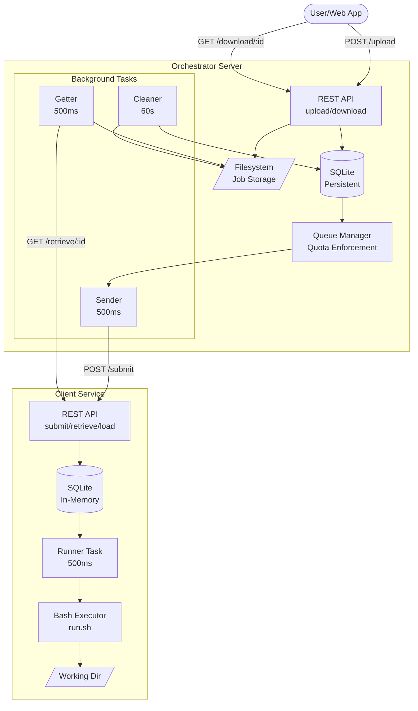
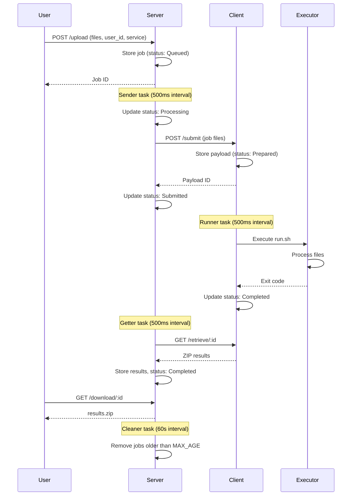
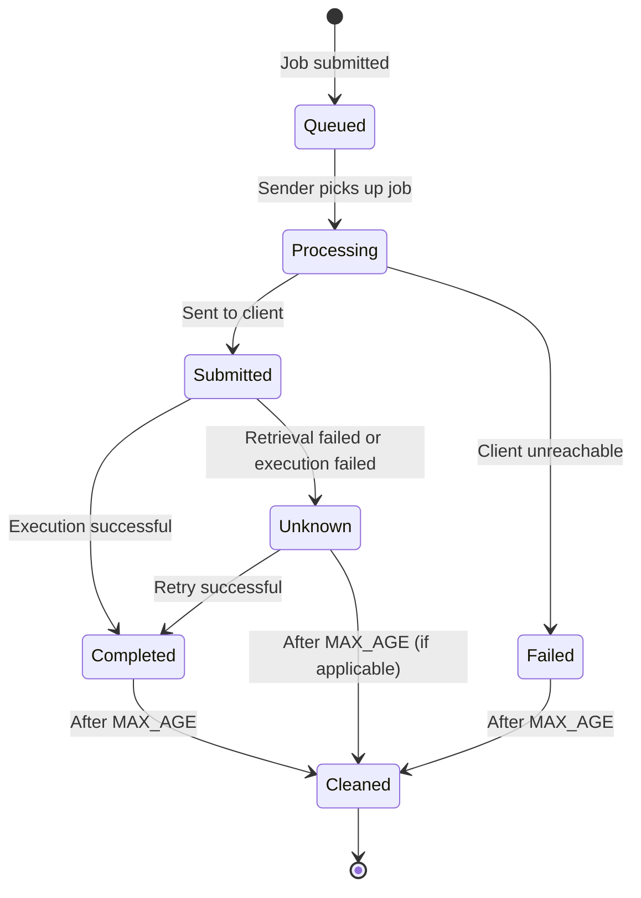
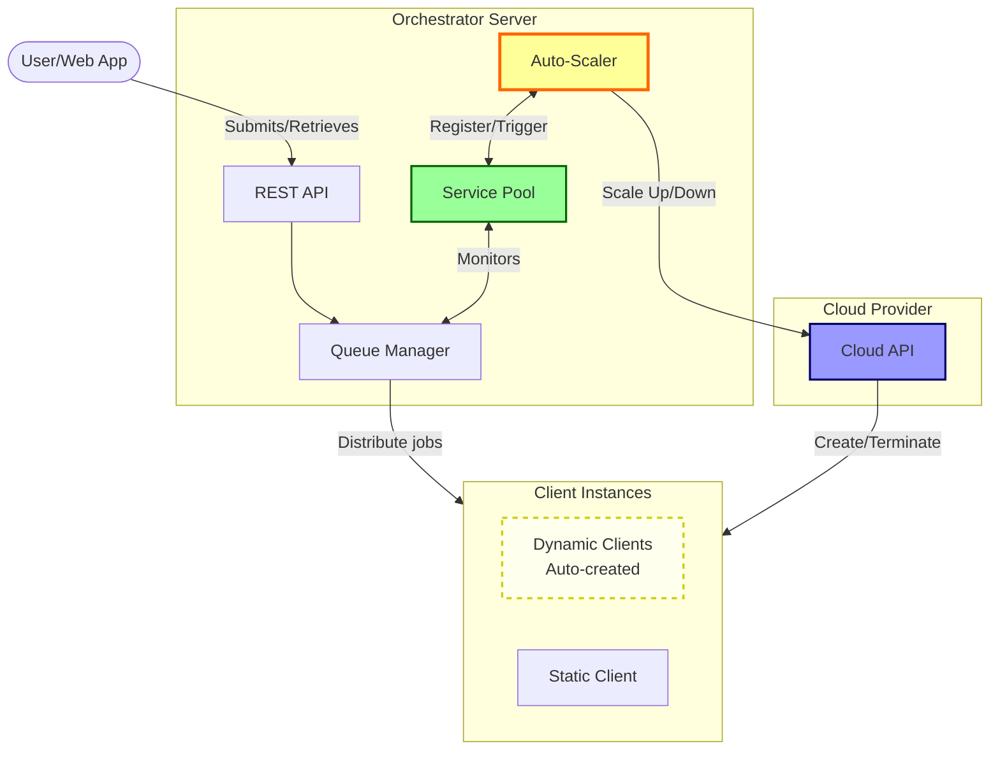

# job-orchestrator


[](https://github.com/rvhonorato/job-orchestrator/actions/workflows/ci.yml)
[](https://app.codacy.com/gh/rvhonorato/job-orchestrator/dashboard?utm_source=gh&utm_medium=referral&utm_content=&utm_campaign=Badge_grade)
[](https://crates.io/crates/job-orchestrator)

> An asynchronous job orchestration system for managing and distributing computational workloads across heterogeneous computing resources with intelligent quota-based load balancing.

## Overview

job-orchestrator is a central component of [WeNMR](https://wenmr.science.uu.nl), a worldwide e-Infrastructure for structural biology operated by the [BonvinLab](https://bonvinlab.org) at [Utrecht University](https://uu.nl). It serves as a reactive middleware layer that connects web applications to diverse computing resources, enabling efficient job distribution for scientific computing workflows.

### Key Features

- **Asynchronous Job Management**: Built with Rust and Tokio for high-performance async operations
- **Quota-Based Load Balancing**: Per-user, per-service quotas prevent resource exhaustion
- **Dual-Mode Architecture**: Runs as server (job orchestration) or client (job execution)
- **Multiple Backend Support**: Extensible to integrate with various computing resources:
  - Native client mode for local job execution
  - [DIRAC Interware](https://dirac.readthedocs.io/en/latest/index.html) _(planned)_
  - SLURM clusters _(planned)_
  - Educational cloud services _(planned)_
- **RESTful API**: Simple HTTP interface for job submission and retrieval
- **Automatic Cleanup**: Configurable retention policies for completed jobs

### Architecture

#### High-level overview



#### Job Lifecycle sequence



#### Job status state machine



#### Auto-Scaling Architecture (Planned Feature)

The orchestrator will support automatic scaling of client instances based on workload, creating and terminating cloud instances dynamically to handle varying job demands efficiently.



> Both server and client modes are provided by the same binary, configured via command-line arguments.

## Quick Start

### Running with Docker Compose

```bash
docker compose up --build
```

This starts both the orchestrator server (port 5000) and an example client (port 9000).

### Submitting a Job

```bash
curl -X POST http://localhost:5000/upload \
  -F "file=@example/run.sh" \
  -F "file=@example/2oob.pdb" \
  -F "user_id=1" \
  -F "service=example" | jq
```

Response:

```json
{
  "id": 1,
  "user_id": 1,
  "service": "example",
  "status": "Queued",
  "loc": "/opt/data/978e5a14-dc94-46ab-9507-fe0a94d688b8",
  "dest_id": ""
}
```

### Checking Job Status

Use HTTP HEAD to check status without downloading:

```bash
curl -I http://localhost:5000/download/1
```

**Status Codes:**

- `200` - Job completed, ready to download
- `202` - Job queued or running
- `204` - Job failed or cleaned up
- `404` - Job not found
- `500` - Internal server error

### Downloading Results

Once the job completes (status `200`):

```bash
curl -o results.zip http://localhost:5000/download/1
```

## How It Works

### Job Lifecycle

1. **Submission**: User uploads files via `/upload` endpoint with `user_id` and `service` parameters
2. **Queuing**: Job enters queue; orchestrator checks user quotas before dispatching
3. **Distribution**: Server sends job to available client matching the service type
4. **Execution**: Client executes the job and signals completion
5. **Retrieval**: Server fetches results from client and stores locally
6. **Download**: User downloads results as a ZIP archive
7. **Cleanup**: Completed jobs are automatically removed after configured retention period (default: 48 hours)

### Quota System

The orchestrator enforces per-user, per-service quotas to ensure fair resource allocation. Configuration example:

```bash
SERVICE_EXAMPLE_RUNS_PER_USER=5  # Max 5 concurrent jobs per user for "example" service
```

This prevents any single user from monopolizing computing resources.

### Testing the Queue

Submit multiple jobs to observe quota-based throttling:

```bash
for i in {1..250}; do
  cat <<EOF > run.sh
#!/bin/bash
sleep \$((RANDOM % 36 + 25))
echo 'Computation complete!' > output.txt
EOF
  curl -s -X POST http://localhost:5000/upload \
    -F "file=@run.sh" \
    -F "user_id=1" \
    -F "service=example" > /dev/null
  echo "Submitted job $i"
done
```

Monitor the orchestration in real-time:

```bash
docker compose logs server --follow
```

You'll see jobs dispatched gradually according to the configured quota limits.

## Use Cases

Orchestrator is designed for scenarios requiring:

- **Scientific Computing Workflows**: Distribute computational biology/chemistry jobs across clusters
- **Multi-Tenant Systems**: Fair resource allocation with per-user quotas
- **Heterogeneous Computing**: Route jobs to appropriate backends (local, HPC, cloud)
- **Web-Based Science Platforms**: Decouple frontend from compute infrastructure
- **Batch Processing**: Handle high-throughput job submissions with automatic queuing

## Project Status

**Current State**: Production-ready with server/client architecture

**Planned Features**:

- **Auto-Scaling**: Dynamic creation and termination of cloud-based client instances based on workload (see [Auto-Scaling Architecture diagram](#auto-scaling-architecture-planned-feature))
- DIRAC Interware integration
- SLURM direct integration
- Enhanced monitoring and metrics
- Job priority queues
- Advanced scheduling policies

## Documentation

- **API Documentation**: Available via Swagger UI at `http://localhost:5000/swagger-ui/` when running
- **Technical Documentation**: Coming soon
- **Configuration Guide**: Coming soon

## Contributing

Contributions, bug reports, and feature requests are welcome via GitHub issues.

## License

MIT License - see [LICENSE](LICENSE) for details.

## Contact

For questions, collaborations, or if you think this project could benefit your use case:

- **Issues**: [GitHub Issues](https://github.com/rvhonorato/job-orchestrator/issues)
- **Email**: Rodrigo V. Honorato <rvhonorato@protonmail.com>
