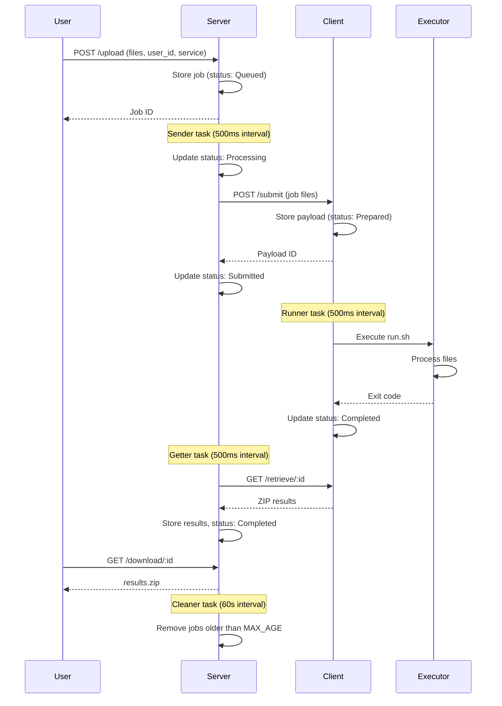
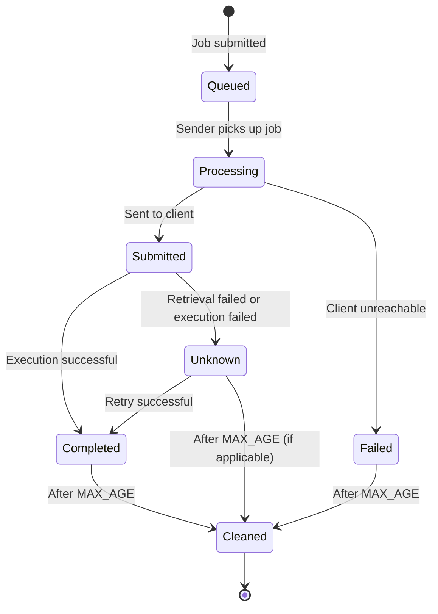

# Job Lifecycle

Understanding the job lifecycle is essential for working with job-orchestrator effectively.

## Lifecycle Sequence

## Job States

## State Descriptions

| State | Description |
|-------|-------------|
| **Queued** | Job received and waiting for dispatch |
| **Processing** | Server is sending job to a client |
| **Submitted** | Job successfully sent to client, awaiting execution |
| **Completed** | Job finished successfully, results available |
| **Failed** | Job failed permanently (client unreachable, execution error) |
| **Unknown** | Temporary state when retrieval fails, will retry |
| **Cleaned** | Job data removed after retention period |

## Lifecycle Stages

### 1. Submission

User uploads files via `POST /upload` with:

- One or more files (including `run.sh`)
- `user_id` - identifies the submitting user
- `service` - which backend should process this job

The server:

1. Validates the request
2. Creates a unique directory for the job
3. Stores all uploaded files
4. Creates a database record with status `Queued`
5. Returns the job ID to the user

### 2. Queuing & Quota Check

The **Sender** background task (runs every 500ms):

1. Finds jobs in `Queued` status
2. Checks if user has available quota for the service
3. If quota available, marks job as `Processing`
4. If quota exceeded, job remains `Queued`

### 3. Distribution

For jobs in `Processing` status:

1. Server packages job files
2. Sends to configured client via `POST /submit`
3. On success: updates status to `Submitted`, stores client's payload ID
4. On failure: updates status to `Failed`

### 4. Execution

On the client side:

1. **Runner** task finds payloads in `Prepared` status
2. Executes `run.sh` in the job directory
3. Captures exit code and any output files
4. Updates payload status to `Completed` (or `Failed` on error)

### 5. Retrieval

The **Getter** background task (runs every 500ms):

1. Finds jobs in `Submitted` status
2. Requests results from client via `GET /retrieve/:id`
3. Downloads and stores the result ZIP
4. Updates job status to `Completed`

### 6. Download

User can now:

1. Check status via `HEAD /download/:id`
2. Download results via `GET /download/:id`
3. Results are returned as a ZIP archive

### 7. Cleanup

The **Cleaner** background task (runs every 60s):

1. Finds jobs older than `MAX_AGE`
2. Deletes job files from filesystem
3. Updates status to `Cleaned` or removes record

## Error Handling

### Client Unreachable

If the server cannot reach a client during distribution:

- Job status changes to `Failed`
- Job will not be retried automatically
- User can resubmit if needed

### Execution Failure

If `run.sh` exits with non-zero code:

- Payload status changes to `Failed`
- Server retrieves whatever output exists
- Job status reflects the failure

### Retrieval Failure

If the server cannot retrieve results:

- Job status changes to `Unknown`
- Server will retry on subsequent Getter cycles
- Eventually succeeds or times out

## Timing Considerations

| Event | Typical Duration |
|-------|------------------|
| Upload to Queued | Immediate |
| Queued to Processing | Up to 500ms (+ quota wait) |
| Processing to Submitted | Depends on file size and network |
| Submitted to Completed | Depends on job execution time |
| Completed to Cleaned | Configured via `MAX_AGE` (default: 48 hours) |
