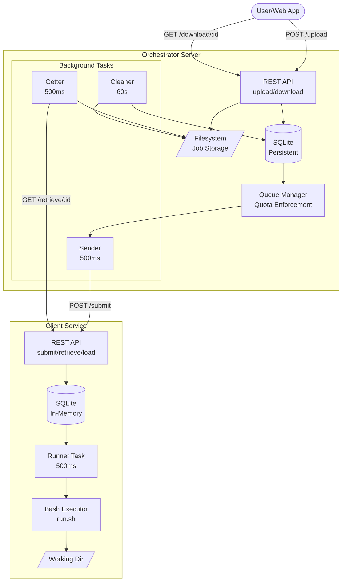
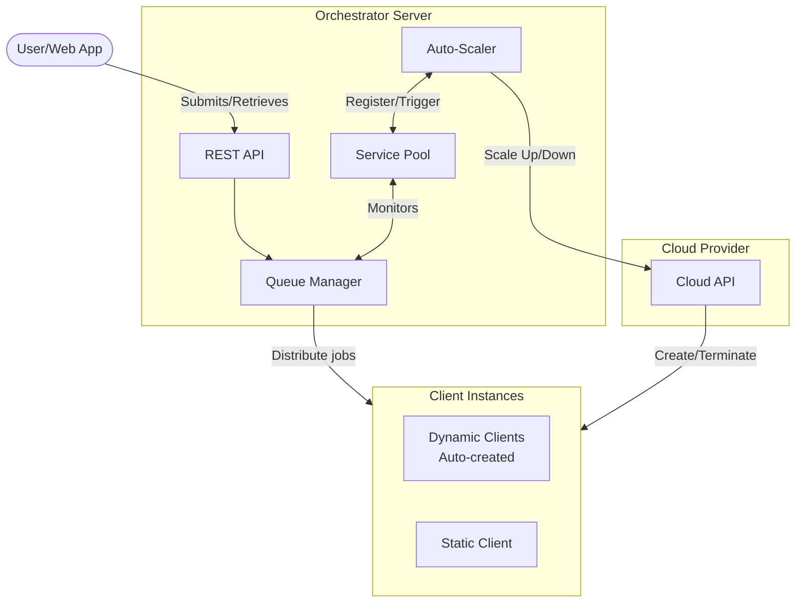

# Architecture Overview

job-orchestrator uses a distributed architecture with a central server coordinating job execution across multiple client nodes.

## High-Level Architecture

## Components

### Orchestrator Server

The central server manages:

- **REST API**: Handles job uploads and result downloads from users
- **SQLite Database**: Persistent storage for job metadata and status
- **Filesystem Storage**: Stores uploaded files and downloaded results
- **Queue Manager**: Enforces per-user quotas and manages job distribution
- **Background Tasks**: Automated processes for job distribution, result retrieval, and cleanup

### Client Service

Each client node handles:

- **REST API**: Receives jobs from server, returns results
- **In-Memory Database**: Lightweight tracking of current payloads
- **Working Directory**: Temporary storage for job execution
- **Runner Task**: Monitors for new payloads and executes them
- **Bash Executor**: Runs the `run.sh` script for each job

## Background Tasks

### Server Tasks

| Task | Interval | Purpose |
|------|----------|---------|
| **Sender** | 500ms | Picks up queued jobs, enforces quotas, dispatches to clients |
| **Getter** | 500ms | Retrieves completed results from clients |
| **Cleaner** | 60s | Removes expired jobs from disk and database |

### Client Tasks

| Task | Interval | Purpose |
|------|----------|---------|
| **Runner** | 500ms | Executes prepared payloads, captures results |

## Data Flow

1. **User** submits files via `POST /upload`
2. **Server** stores files and creates job record (status: `Queued`)
3. **Sender** task picks up job, checks quotas, sends to available client
4. **Client** receives job, stores as payload (status: `Prepared`)
5. **Runner** task executes `run.sh`, updates status to `Completed`
6. **Getter** task retrieves results, stores locally
7. **User** downloads results via `GET /download/:id`
8. **Cleaner** task removes job after retention period

## Auto-Scaling Architecture (Planned)

The orchestrator will support automatic scaling of client instances based on workload:

This feature will enable:

- Dynamic creation of cloud-based client instances during high demand
- Automatic termination of idle instances to reduce costs
- Load-aware job distribution across available clients
